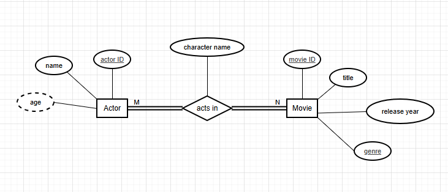

# Q1. 
1. Entities & Relationships
	- Actor - actor ID, name, age 
	- Movie - movie ID, title, release year, genre
2. Relationships
	- actor-movie : acts in (attribute: )

## Note
participation constraints

4. ER Diagram
   
	

# Q2
## ER Diagram

## Assumptions
- phone attribute of patient has multiple values. it is a multi-valued attribute
- phone attribute of doctor has multiple values. it is a multi-valued attribute
- each appointment can resulted in many prescriptions and one prescrition can only resulted by one appointment.
	so appointment-prescription is 1 to many relationship
- 1 patient can undergo multiple medical tests and 1 test can be attended by many patients
	so patient-medical test is many to many relationship
- 1 appointment can have many medical tests but 1 medical test can only be done by 1 appointment
	so medicaltest-appointment is many to 1 relationship

# Q3

