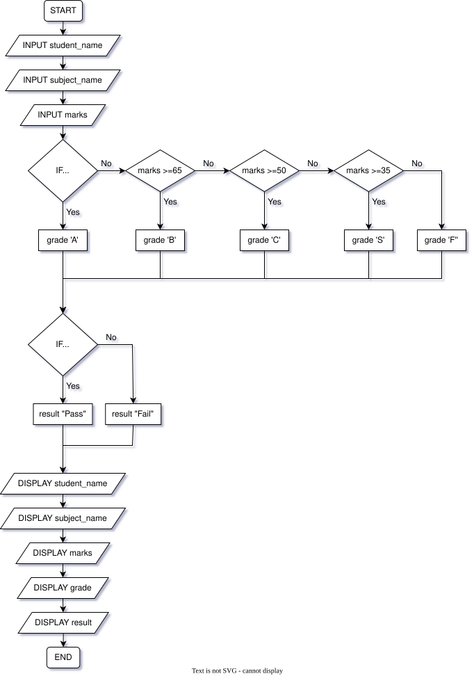

## Tutorial #4 (2026 May 27)
### Student Mark Record System
#### Pseudo Code
```
START
      INPUT student_name
      INPUT subject_name
      INPUT marks

      IF marks >= 75 then
            grade 'A'
      ELSE IF marks >= 65 then
            grade 'B'
      ELSE IF marks >= 50 then
            grade 'C'
      ELSE IF marks >= 35 then
            grade 'S'
      ELSE then
            grade 'F'
      END IF

      IF marks >= 35 then
            resut "Pass"
      ELSE then
            result "Fail"
      END IF

      DISPLAY student_name
      DISPLAY subject_name
      DISPLAY marks
      DISPLAY grade
      DISPLAY result
END
```
___
#### Flow Chart   
