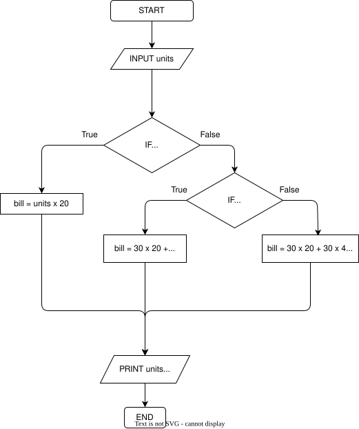

### Q1 - Scolarship Attendance Checker
```python
attendance = float(input("Attendence(%): "))

if attendance >= 80:
    avg_mark = float(input("Average Attendance (%): "))
    if avg_mark >= 75:
        print("Scolarship Awarded")
    else:
        print("Scolarship Not Awarded")
else:
    print("Insufficient Attendance")
```

### Q2 - Online Discount Checher
```python
is_prem = input("Is Customer a Premium Member? (Y/N) ")
if is_prem.capitalize() == "Y":
      purchase = float(input("Enter the purchased amount: "))
      if purchase >= 10000:
            print("20% Discount Applied")
            Disc = purchase * 20 / 100
            print("Discout = " + str(Disc))
      else:
            print("10% Discount Applied")
            Disc = purchase * 10 / 100
            print("Discout = " + str(Disc))
else:
      print("No Discount Available")
```
### Q3 - Promotion Eligibility Checker
```python
perform = float(int("Employee's Performance Score: (/100)"))
if perform >= 85:
      years_serv = int(input("Years of Service: "))
      if years_serv >= 3:
            print("Promotion Approved")
      else:
            print("More Experience Required")
else:
      print("Performance Improvement Required")
```
### Q4 - Electricity Bill Calculator
```python
units = int(input("Number of Units Consumed: "))

if units >= 1 and units <= 30:
      bill = units * 20
else:
      if units >= 31 and units <= 60:
            bill = (30 * 20) + (units - 30)*40
      else:
            bill = (30 * 20) + (30 * 40) + (units - 60)*60

print("Comsumed Units >>> " + str(units))
print("Total Bill >>> Rs. " + str(bill))
```
